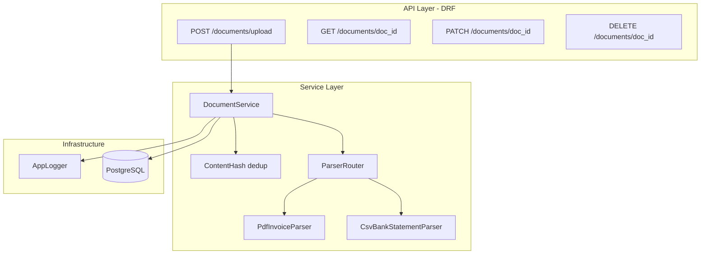

# Django Financial Documents Backend — Phase 1 Plan

## Current state

The workspace is a **fresh Django 6.0.5** project at `[myproject/](c:\Users\nk095\OneDrive\Documents\lincoln_test\myproject)` with:

- SQLite in `[settings.py](c:\Users\nk095\OneDrive\Documents\lincoln_test\myproject\myproject\settings.py)` (lines 75–79)
- No custom apps, no `requirements.txt`, no Docker

You chose **Django over FastAPI** and **409 on duplicate uploads** with **optional `X-User-Id` header** for ownership.

---

## Target architecture (Phase 1)




Parsing runs **synchronously in the upload request** for Phase 1 (status moves `processing` → `completed` or `failed` before response). Background workers (Celery) are deferred to a later phase.

---

## 1. PostgreSQL instead of SQLite

### Dependencies (`[requirements.txt](c:\Users\nk095\OneDrive\Documents\lincoln_test\requirements.txt)` at repo root)

```
django>=6.0,<7
djangorestframework>=3.15
psycopg[binary]>=3.2
python-dotenv>=1.0
pdfplumber>=0.11
python-dateutil>=2.9
```

### Settings changes in `[myproject/settings.py](c:\Users\nk095\OneDrive\Documents\lincoln_test\myproject\myproject\settings.py)`

- Load env via `python-dotenv` from `BASE_DIR / '.env'`
- Replace `DATABASES` with PostgreSQL:

```python
DATABASES = {
    'default': {
        'ENGINE': 'django.db.backends.postgresql',
        'NAME': os.getenv('POSTGRES_DB', 'documents_db'),
        'USER': os.getenv('POSTGRES_USER', 'documents_user'),
        'PASSWORD': os.getenv('POSTGRES_PASSWORD', 'documents_pass'),
        'HOST': os.getenv('POSTGRES_HOST', 'localhost'),
        'PORT': os.getenv('POSTGRES_PORT', '5432'),
    }
}
```

- Add `rest_framework`, `documents` to `INSTALLED_APPS`
- Configure `MEDIA_ROOT` / `MEDIA_URL` for uploaded files
- `ALLOWED_HOSTS`, `SECRET_KEY` from env for deploy readiness

### Docker Compose (`[docker-compose.yml](c:\Users\nk095\OneDrive\Documents\lincoln_test\docker-compose.yml)`)

- `db`: PostgreSQL 16 with named volume
- `web`: Django app (build from `Dockerfile`), depends on `db`, env from `.env.example`
- Expose port `8000`

### Env template (`[.env.example](c:\Users\nk095\OneDrive\Documents\lincoln_test\.env.example)`)

Document all vars: `POSTGRES_*`, `DJANGO_SECRET_KEY`, `DEBUG`, `MAX_UPLOAD_SIZE_MB`, `LOG_LEVEL`.

---

## 2. Logger class

Create `[myproject/core/logging.py](c:\Users\nk095\OneDrive\Documents\lincoln_test\myproject\core\logging.py)` (new `core` package, not a Django app):


| Responsibility              | Detail                                                                                     |
| --------------------------- | ------------------------------------------------------------------------------------------ |
| Singleton-style `AppLogger` | Wraps Python `logging` with consistent format                                              |
| Handlers                    | Console (dev) + optional rotating file (`logs/app.log`)                                    |
| Context                     | Methods accept `extra` dict: `doc_id`, `user_id`, `content_hash`, `event`                  |
| Levels                      | Driven by `LOG_LEVEL` env var                                                              |
| Usage                       | Injected in services/views; log upload start, dedup hit, parse success/failure, API errors |


Example log line format:

```
2026-05-22 10:15:00 | INFO | documents.upload | doc_id=... | user_id=... | Upload accepted
```

Wire Django’s existing `LOGGING` dict in settings to use the same formatter for consistency.

---

## 3. Database schema (normalized)

New Django app: `**documents**` at `[myproject/documents/](c:\Users\nk095\OneDrive\Documents\lincoln_test\myproject\documents)`.

### `Document` model


| Field                       | Type                                                     | Notes                              |
| --------------------------- | -------------------------------------------------------- | ---------------------------------- |
| `doc_id`                    | `UUIDField(primary_key=True, default=uuid4)`             | Returned to client                 |
| `content_hash`              | `CharField(64, unique=True, db_index=True)`              | SHA-256 hex of raw bytes           |
| `user`                      | `ForeignKey(User, null=True, on_delete=SET_NULL)`        | Set from `X-User-Id` if valid      |
| `document_type`             | `CharField` choices: `invoice_pdf`, `bank_statement_csv` | Inferred from extension/MIME       |
| `status`                    | `CharField` choices: `processing`, `completed`, `failed` |                                    |
| `original_filename`         | `CharField`                                              |                                    |
| `file`                      | `FileField(upload_to='uploads/%Y/%m/')`                  | Stored on disk/media               |
| `vendor`                    | `CharField(null=True)`                                   | Invoice vendor or derived from CSV |
| `document_date`             | `DateField(null=True)`                                   | Normalized to ISO date             |
| `total_amount`              | `DecimalField(null=True)`                                | Invoice total or net from CSV      |
| `currency`                  | `CharField(3, null=True)`                                | Normalized uppercase ISO-like      |
| `error_message`             | `TextField(blank=True)`                                  | Human-readable failure             |
| `metadata`                  | `JSONField(default=dict)`                                | Invoice #, subtotal, tax, etc.     |
| `created_at` / `updated_at` | `DateTimeField`                                          | auto                               |


### `LineItem` model (PDF invoices)

- FK → `Document`
- `description`, `amount` (`DecimalField`), optional `quantity`, `sort_order`

### `BankTransaction` model (CSV statements)

- FK → `Document`
- `transaction_date`, `description`, `debit`, `credit`, `balance`, `currency`

Indexes: `(user, status)`, `(vendor)`, `(document_date)`, `(currency)`, `(document_type)`.

---

## 4. Parsing layer (messy input handling)

### Shared utilities — `[documents/parsers/utils.py](c:\Users\nk095\OneDrive\Documents\lincoln_test\myproject\documents\parsers\utils.py)`

- `**parse_date(value)**` — try `YYYY-MM-DD`, `DD/MM/YYYY`, `MM/DD/YYYY`, `dateutil.parser` for `Jan 15 2024`
- `**parse_amount(value)**` — strip `$`, commas, whitespace; return `Decimal`
- `**normalize_currency(value)**` — uppercase, default `USD` if missing on CSV rows

### PDF invoice parser — `[documents/parsers/pdf_invoice.py](c:\Users\nk095\OneDrive\Documents\lincoln_test\myproject\documents\parsers\pdf_invoice.py)`

1. Extract text with `pdfplumber`
2. Regex/line-based extraction for:
  - `Invoice #`, `Vendor`, `Date`, `Currency`
  - Line items: `- description $amount` (flexible spacing)
  - `Subtotal`, `Tax`, `Total`
3. Missing fields → `null` in DB, partial success allowed
4. On unreadable PDF → raise `ParseError` → document `status=failed`

### CSV bank parser — `[documents/parsers/csv_bank.py](c:\Users\nk095\OneDrive\Documents\lincoln_test\myproject\documents\parsers\csv_bank.py)`

1. Read with `csv.DictReader`; **normalize headers** (lowercase, strip spaces)
2. Map flexible column names, e.g. `date`/`csvdate`, `desc`/`description`, `debit`/`withdrawal`
3. **Reorder-tolerant**: build row dict by header name, not position
4. Per-row: tolerate missing debit/credit; infer currency from row or file-level default
5. Document-level summary: earliest date, dominant currency, optional vendor from first description

### Router — `[documents/parsers/router.py](c:\Users\nk095\OneDrive\Documents\lincoln_test\myproject\documents\parsers\router.py)`

Select parser by `document_type`; return structured `ParsedDocument` dataclass consumed by service layer.

---

## 5. API design (Django REST Framework)

Base path: `**/documents/`** registered in `[myproject/urls.py](c:\Users\nk095\OneDrive\Documents\lincoln_test\myproject\myproject\urls.py)`.

### `POST /documents/upload`

- **Content-Type**: `multipart/form-data`, field name `file`
- **Validation**:
  - Allowed: `.pdf`, `.csv` (and MIME check)
  - Max size from `MAX_UPLOAD_SIZE_MB` (e.g. 10 MB)
  - Reject empty files
- **Flow**:
  1. Read bytes → `content_hash = sha256(bytes).hexdigest()`
  2. If hash exists → **409** `{ "detail": "Duplicate document", "doc_id": "<existing>" }`
  3. Resolve `user` from optional header `X-User-Id` (integer PK); invalid/missing → `user=null`
  4. Create `Document(status=processing)`, save file
  5. Run parser synchronously; on success → `completed` + child rows; on failure → `failed` + `error_message`
  6. Return **201** `{ "doc_id": "<uuid>", "status": "<processing|completed|failed>" }`

Note: Because parsing is sync in Phase 1, `status` in the 201 body will usually be `completed` or `failed`, not `processing`. The field remains for future async workers.

### `GET /documents/{doc_id}`

Return document metadata + nested `line_items` or `transactions` based on type.

### `PATCH /documents/{doc_id}`

Update **metadata only** (not re-parse): e.g. `vendor`, `document_date`, `currency`, `metadata` JSON. Validate with serializer; return updated resource.

### `DELETE /documents/{doc_id}`

soft delete document, child rows (CASCADE), and media file. Return **204**. fit he doc_id is not present then return not found. 

### Error responses (DRF)


| Case                                        | Status                                                    |
| ------------------------------------------- | --------------------------------------------------------- |
| Invalid file type/size                      | 400                                                       |
| Duplicate content                           | 409                                                       |
| Not found                                   | 404                                                       |
| Parse failure (stored, still 201 on upload) | Document has `status=failed`; GET exposes `error_message` |


### Serializers — `[documents/serializers.py](c:\Users\nk095\OneDrive\Documents\lincoln_test\myproject\documents\serializers.py)`

- `DocumentUploadSerializer` — file validation only
- `DocumentDetailSerializer` — read with nested children
- `DocumentUpdateSerializer` — PATCH fields whitelist

### Views — `[documents/views.py](c:\Users\nk095\OneDrive\Documents\lincoln_test\myproject\documents\views.py)`

`DocumentViewSet` or dedicated APIViews:

- `upload` action (POST, no `doc_id` in URL)
- `retrieve`, `partial_update`, `destroy` on `doc_id` lookup field

### Service layer — `[documents/services/document_service.py](c:\Users\nk095\OneDrive\Documents\lincoln_test\myproject\documents\services\document_service.py)`

Keeps views thin: hash check, create, parse, persist, delete file on rollback.

---

## 6. Security and config (Phase 1 baseline)

- File extension + content-type whitelist
- Max upload size enforced before saving
- No auth yet; `X-User-Id` is a **testing placeholder** (document in README)
- `SECRET_KEY` and DB creds from env only
- Do not commit `.env`

---

## 7. Sample files and README (minimal for Phase 1)

Add under `[samples/](c:\Users\nk095\OneDrive\Documents\lincoln_test\samples)`:

- `invoice_acme.pdf` (text-based PDF matching your invoice template)
- `bank_statement.csv` (your CSV example + one variant with reordered columns and `DD/MM/YYYY` dates)

`[README.md](c:\Users\nk095\OneDrive\Documents\lincoln_test\README.md)`: setup (venv, Docker, migrate), curl examples for all four endpoints, schema overview, known limitations.

---

## 8. File / folder layout (after implementation)

```
lincoln_test/
├── docker-compose.yml
├── Dockerfile
├── .env.example
├── requirements.txt
├── samples/
├── myproject/
│   ├── manage.py
│   ├── core/
│   │   └── logging.py
│   ├── documents/
│   │   ├── models.py
│   │   ├── serializers.py
│   │   ├── views.py
│   │   ├── urls.py
│   │   ├── admin.py
│   │   ├── parsers/
│   │   │   ├── utils.py
│   │   │   ├── pdf_invoice.py
│   │   │   ├── csv_bank.py
│   │   │   └── router.py
│   │   └── services/
│   │       └── document_service.py
│   └── myproject/
│       ├── settings.py
│       └── urls.py
```

---

## 9. Implementation order

1. Add `requirements.txt`, `.env.example`, Docker Compose + PostgreSQL settings
2. Create `core` logger + settings `LOGGING` integration
3. Create `documents` app + models + migrations
4. Implement parsers + unit tests for date/amount/csv column mapping
5. Implement `DocumentService` + DRF views/urls
6. Register admin for debugging
7. Add sample files + README with API examples
8. Manual smoke test: upload PDF, upload CSV, duplicate → 409, GET/PATCH/DELETE

---

## 10. Known limitations (Phase 1)

- Parsing is **synchronous** — large PDFs block the request
- PDF parsing assumes **text-extractable** PDFs (not scanned images/OCR)
- `X-User-Id` is not authenticated — production needs real auth
- Search/filter/list endpoints from the full spec are **out of scope** for this phase
- No Celery/Redis yet

---

## Later phases (not in this implementation)

- `GET /documents` with search (vendor, date range, amount, currency, type, status)
- Celery background parsing (`status=processing` truly async)
- Auth (JWT/session) replacing `X-User-Id`
- Unit test coverage per your naming convention
- Cloud deployment doc (Render/AWS)

