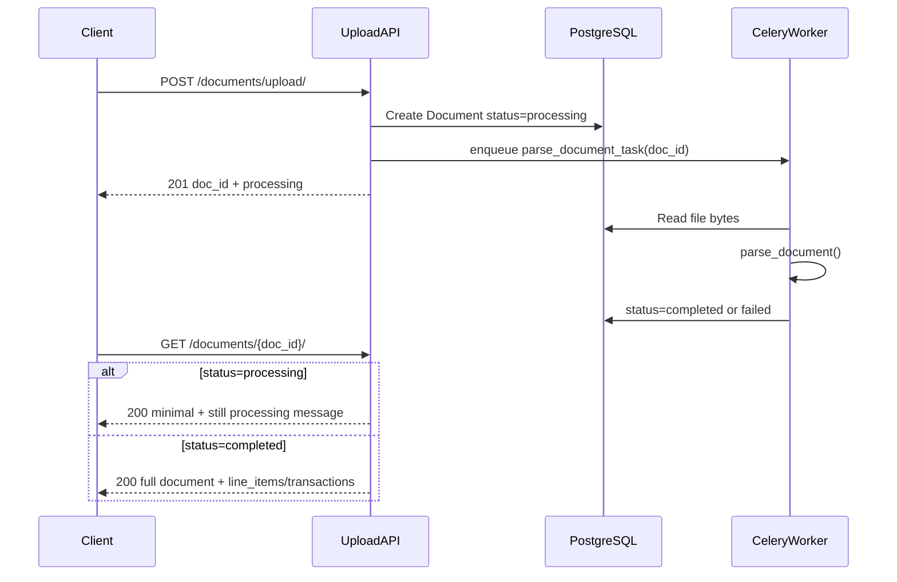

# Django Financial Documents Backend — Phase 2 Plan

## Root cause: incomplete `doc_id` returns HTML 404

[`documents/urls.py`](c:\Users\nk095\OneDrive\Documents\lincoln_test\myproject\documents\urls.py) uses Django’s strict path converter:

```python
path('<uuid:doc_id>/', DocumentDetailView.as_view(), ...)
```

An incomplete UUID (e.g. `43ee75e4-5f6a-4c12-9c02-30fb60ea446` vs full `...4468`) **never reaches** `DocumentDetailView`. Django’s URL resolver fails first and returns the default **HTML** “Page not found” page.

### Fix (item 1)

- Change URL pattern to `<str:doc_id>/` for GET, PATCH, DELETE.
- Add helper [`documents/utils.py`](c:\Users\nk095\OneDrive\Documents\lincoln_test\myproject\documents\utils.py):

```python
def parse_doc_id(value: str) -> uuid.UUID | None:
    try:
        return uuid.UUID(str(value))
    except (ValueError, AttributeError):
        return None
```

- In [`DocumentDetailView`](c:\Users\nk095\OneDrive\Documents\lincoln_test\myproject\documents\views.py): if `parse_doc_id` returns `None` → **400** JSON:

```json
{"detail": "Invalid document id format."}
```

- If valid UUID but not in DB (or soft-deleted) → **404** JSON `{"detail": "Not found."}` (unchanged behavior).

Apply the same validation in all detail methods (`get`, `patch`, `delete`).

---

## Async parsing with Celery (item 2)



### Infrastructure

| Component | Change |
|-----------|--------|
| [`requirements.txt`](c:\Users\nk095\OneDrive\Documents\lincoln_test\requirements.txt) | Add `celery[redis]>=5.4`, `redis>=5.0` |
| [`docker-compose.yml`](c:\Users\nk095\OneDrive\Documents\lincoln_test\docker-compose.yml) | Add `redis` service; add `worker` service running `celery -A myproject worker`; optional `CELERY_BROKER_URL` in `.env` |
| [`myproject/settings.py`](c:\Users\nk095\OneDrive\Documents\lincoln_test\myproject\myproject\settings.py) | Celery app config (`CELERY_BROKER_URL`, result backend optional) |
| New [`myproject/celery.py`](c:\Users\nk095\OneDrive\Documents\lincoln_test\myproject\myproject\celery.py) | Celery app bootstrap |
| New [`documents/tasks.py`](c:\Users\nk095\OneDrive\Documents\lincoln_test\myproject\documents\tasks.py) | `parse_document_task(doc_id: str)` |

### Service refactor ([`document_service.py`](c:\Users\nk095\OneDrive\Documents\lincoln_test\myproject\documents\services\document_service.py))

- **`upload()`**: create document with `status=processing`, save file, **do not parse inline**. Enqueue `parse_document_task.delay(str(doc_id))`. Return document immediately.
- **New `parse_and_persist(doc_id)`**: load document + file bytes, run `parse_document()`, call `_apply_parsed_data()`, set `completed` or `failed` (extract lines 107–125 into this method). Used only by Celery task.
- **Upload response**: almost always `"status": "processing"` on 201.

### GET detail while processing ([`DocumentDetailView.get`](c:\Users\nk095\OneDrive\Documents\lincoln_test\myproject\documents\views.py))

When `document.status == processing`:

```json
{
  "doc_id": "...",
  "status": "processing",
  "detail": "Document is still being processed."
}
```

Return **200** (not 404). Omit `line_items` / `transactions` until complete.

When `completed` / `failed`: return full [`DocumentDetailSerializer`](c:\Users\nk095\OneDrive\Documents\lincoln_test\myproject\documents\serializers.py) payload (failed docs include `error_message`).

### Local dev note

Celery worker must be running alongside `runserver`:

```bash
celery -A myproject worker -l info
```

Document this in [`README.md`](c:\Users\nk095\OneDrive\Documents\lincoln_test\README.md).

**Fallback for dev without Redis**: optional `SYNC_PARSE=true` env flag to keep inline parsing (documented only; default is async).

---

## Search and filtering (item 3)

Add **list endpoint** (original spec): `GET /documents/` — separate from detail GET.

### URL order in [`documents/urls.py`](c:\Users\nk095\OneDrive\Documents\lincoln_test\myproject\documents\urls.py)

```python
path('upload/', ...)
path('', DocumentListView.as_view(), name='document-list')      # before detail
path('<str:doc_id>/', DocumentDetailView.as_view(), ...)
```

### Query parameters

| Param | Filters |
|-------|---------|
| `vendor` | `vendor__icontains` |
| `date_from` | `document_date__gte` |
| `date_to` | `document_date__lte` |
| `amount_min` | `total_amount__gte` |
| `amount_max` | `total_amount__lte` |
| `currency` | exact match (normalized uppercase) |
| `document_type` | `invoice_pdf` / `bank_statement_csv` |
| `status` | `processing` / `completed` / `failed` |

- Only non-deleted documents (`is_deleted=False`).
- Optional `X-User-Id` filter: scope to that user’s docs when header present.
- Pagination: DRF `PageNumberPagination` (e.g. 20 per page).
- Response: [`DocumentListSerializer`](c:\Users\nk095\OneDrive\Documents\lincoln_test\myproject\documents\serializers.py) — summary fields (no nested line items by default).

### Service

New `DocumentService.list_documents(filters: dict) -> QuerySet` in [`document_service.py`](c:\Users\nk095\OneDrive\Documents\lincoln_test\myproject\documents\services\document_service.py).

New `DocumentListView` in [`views.py`](c:\Users\nk095\OneDrive\Documents\lincoln_test\myproject\documents\views.py).

---

## API tests (item 4)

No tests exist today. Add under [`myproject/documents/tests/`](c:\Users\nk095\OneDrive\Documents\lincoln_test\myproject\documents\tests\):

```
documents/tests/
  __init__.py
  test_document_upload_api.py
  test_document_detail_api.py
  test_document_list_api.py
```

Use `rest_framework.test.APIClient` + `django.test.TestCase`. For Celery tests: `CELERY_TASK_ALWAYS_EAGER=True` in test settings so tasks run synchronously without Redis.

### Naming convention ([`testcase_standard.txt`](c:\Users\nk095\OneDrive\Documents\lincoln_test\myproject\logs\testcase_standard.txt))

- Class: `DocumentUploadApiTest`, `DocumentDetailApiTest`, `DocumentListApiTest`
- Methods: `test_{view_or_class}__{condition}__{expected_outcome}`
- Structure: `# Given` / `# When` / `# Then`
- Class docstring lists all test scenarios covered
- Assertions: expected first, actual second

### Scenarios mapped from Postman collection

**Upload** ([`lincoln test.postman_collection.json`](c:\Users\nk095\OneDrive\Documents\lincoln_test\samples\lincoln test.postman_collection.json)):

| Test | Expected |
|------|----------|
| No file | 400 |
| Empty file | 400 |
| PDF/CSV success | 201, `status=processing` (then eager task → completed) |
| Duplicate upload | 409 + existing `doc_id` |
| Unsupported extension | 400 |

**Detail (GET/PATCH/DELETE)**:

| Test | Expected |
|------|----------|
| Valid GET completed doc | 200 + parsed fields |
| GET while processing | 200 + `detail` still processing message |
| Incomplete/invalid `doc_id` | **400** invalid format |
| Unknown valid UUID | 404 |
| PATCH metadata | 200 updated fields |
| DELETE success | 204 |
| DELETE already deleted | 404 |

**List**:

| Test | Expected |
|------|----------|
| Filter by vendor | matching subset |
| Filter by date range | inclusive bounds |
| Filter by amount range | inclusive bounds |
| Filter by currency, type, status | exact match |
| Combined filters | AND logic |
| Empty result | 200 `[]` |

### Test fixtures

- Reuse [`samples/invoice_acme.pdf`](c:\Users\nk095\OneDrive\Documents\lincoln_test\samples\invoice_acme.pdf) and [`samples/bank_statement.csv`](c:\Users\nk095\OneDrive\Documents\lincoln_test\samples\bank_statement.csv)
- `setUp`: create test user for `X-User-Id: 1`
- Helper to upload and wait for eager Celery completion before GET assertions

---

## Files to create or modify (summary)

| File | Action |
|------|--------|
| `documents/urls.py` | `<str:doc_id>`, add list route |
| `documents/utils.py` | **new** UUID validation |
| `documents/views.py` | 400 handling, list view, processing GET response |
| `documents/serializers.py` | list + processing response serializers |
| `documents/services/document_service.py` | async upload, `parse_and_persist`, `list_documents` |
| `documents/tasks.py` | **new** Celery task |
| `myproject/celery.py`, `myproject/__init__.py` | Celery app |
| `myproject/settings.py` | Celery + test eager mode |
| `docker-compose.yml`, `.env.example`, `requirements.txt` | Redis + worker |
| `documents/tests/*.py` | **new** API tests |
| `README.md` | Phase 2 endpoints, Celery worker, query params |

---

## Implementation order

1. Fix `doc_id` routing + 400/404 JSON responses
2. Refactor parsing into `parse_and_persist`; wire Celery task + docker/redis
3. Update upload + GET processing behavior
4. Add `GET /documents/` list with filters + pagination
5. Write API tests (eager Celery); run `python manage.py test documents`
6. Update README

---

## Known limitations (Phase 2)

- Celery worker required in production (upload stays `processing` forever if worker is down)
- List endpoint does not search inside line items / transactions (document-level fields only)
- No auth yet; `X-User-Id` remains a test placeholder
